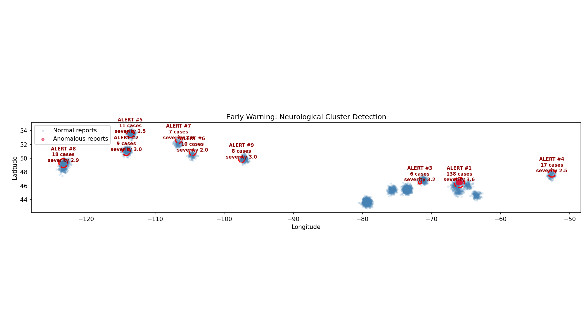
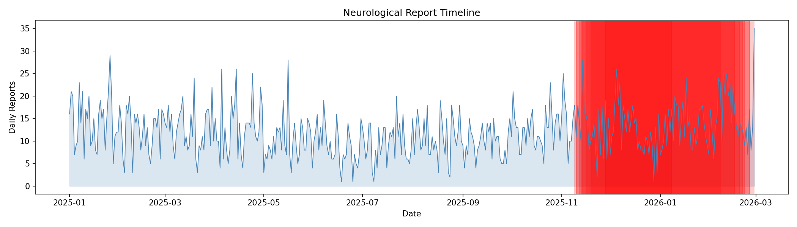

# NeuroWatch

**AI-Powered Early Warning System for Neurological Disease Clusters**

NeuroWatch is a surveillance system that detects anomalous clusters of neurological symptoms across Canada using an ensemble of three independent AI detectors. It was built in response to a real gap: the [New Brunswick neurological syndrome](https://en.wikipedia.org/wiki/New_Brunswick_neurological_syndrome_of_unknown_cause) that went undetected for months because no automated system was watching for spatial concentrations of rare neurological conditions.

---

## Background

In 2020, clinicians in New Brunswick began noticing patients presenting with unexplained neurological symptoms — progressive cognitive decline, ataxia, myoclonus, and memory loss. By the time public health authorities recognized the cluster, dozens of cases had accumulated across rural communities. Investigations pointed to possible environmental exposures, but the delay in detection meant critical early data was lost.

NeuroWatch asks: **what if an AI system had been watching?**

The system uses synthetic data modeled on real Canadian geography, demographics, and environmental conditions to demonstrate that an ensemble AI approach can catch these clusters early — while respecting patient privacy and surfacing the environmental and social context that decision-makers need.

---

## How It Works

NeuroWatch runs three independent detectors in parallel. An alert only reaches critical confidence when multiple detectors independently agree, controlling the false discovery rate at 5%.

### Architecture

```
                         ┌──────────────────────┐
                         │   Neurological Case   │
                         │       Reports         │
                         └──────────┬───────────┘
                                    │
                    ┌───────────────┼───────────────┐
                    ▼               ▼               ▼
          ┌─────────────┐  ┌──────────────┐  ┌─────────────┐
          │   Spatial    │  │   Poisson    │  │ Autoencoder │
          │    Scan      │  │    Rate      │  │  (PyTorch)  │
          │             │  │             │  │             │
          │ Isolation   │  │ Grid-based   │  │ Learns      │
          │ Forest +    │  │ excess rate  │  │ "normal"    │
          │ DBSCAN      │  │ detection +  │  │ report      │
          │             │  │ BH-FDR      │  │ distributions│
          └──────┬──────┘  └──────┬──────┘  └──────┬──────┘
                 │                │                 │
                 └────────────────┼─────────────────┘
                                  ▼
                      ┌───────────────────┐
                      │  Ensemble Scorer  │
                      │                   │
                      │ Normalize scores  │
                      │ Merge overlapping │
                      │ Rank by confidence│
                      └─────────┬─────────┘
                                │
                  ┌─────────────┼─────────────┐
                  ▼             ▼             ▼
          ┌──────────┐  ┌──────────────┐  ┌──────────┐
          │  Enviro  │  │ Socioeconomic│  │ Response │
          │   Risk   │  │ Vulnerability│  │ Protocol │
          │ Scoring  │  │  Analysis    │  │ (CRIT→LOW)│
          └──────────┘  └──────────────┘  └──────────┘
                                │
                                ▼
                    ┌───────────────────────┐
                    │   Dashboard + Map     │
                    │   (Situation Report)  │
                    └───────────────────────┘
```

### The Three Detectors

| Detector | Method | What It Catches |
|----------|--------|-----------------|
| **Spatial Scan** | Isolation Forest + DBSCAN | Geographic clusters with anomalous symptom patterns (50 km radius) |
| **Poisson Rate** | Grid-based excess detection + Benjamini-Hochberg FDR | Cells where recent case counts significantly exceed baseline rates (≥2x excess) |
| **Autoencoder** | PyTorch neural network (encoder-decoder) | Subtle distributional anomalies that combine multiple mild features |

### Contextual Enrichment

Each alert is automatically enriched with:
- **Environmental risk scoring** — industrial site proximity, water quality (CCME WQI), air quality (AQHI) within 50 km
- **Socioeconomic vulnerability** — median income, unemployment, physician density, hospital distance, food insecurity
- **Response protocols** — tiered actions from CRITICAL (notify CMO within 1h) to LOW (routine monitoring)

---

## Dashboard

The interactive dashboard presents findings as an executive-friendly **Situation Report** with:

- Status overview and KPI summary
- Primary finding card with severity and risk scores
- Interactive Folium map with toggleable layers (alerts, industrial sites, water quality, air quality, socioeconomic zones)
- Filterable alerts table with confidence badges
- Timeline chart showing daily case counts
- Collapsible environmental detail panels
- Explain Mode toggle for understanding every metric




---

## Privacy Safeguards

NeuroWatch was refined against a simulated Health Canada expert review (ML engineer, biostatistician, epidemiologist, privacy officer, operations analyst — 14 fixes total):

- **Coordinate rounding** — ~11 km resolution, no individual can be pinpointed
- **Age banding** — exact ages replaced with bands (e.g., 40–49)
- **Small-cell suppression** — alerts with <5 cases automatically filtered
- **Audit logging** — every pipeline run logged with timestamps and parameters
- **Data leakage prevention** — autoencoder uses baseline-only BallTree for scoring
- **FDR correction** — Benjamini-Hochberg at 5% across all statistical tests

---

## Key Results

| Metric | Value |
|--------|-------|
| Independent detectors | 3 |
| False discovery rate | Controlled at 5% |
| NB cluster detection | **HIGH confidence** |
| Expert review fixes | 14 |
| Synthetic dataset | 5,000 baseline + 120 injected anomalous cases |
| Symptoms tracked | 14 neurological symptoms |

When tested against the synthetic NB mystery illness dataset, NeuroWatch independently flagged the Rural New Brunswick cluster with HIGH confidence — exactly the early signal that was missed in real life.

---

## Project Structure

```
neuro-early-warning/
├── run_pipeline.py          # Main orchestrator — runs all detectors + env analysis + viz
├── detector.py              # SpatialScanDetector, PoissonRateDetector, Alert dataclass
├── autoencoder.py           # PyTorch autoencoder detector
├── ensemble.py              # Merges overlapping alerts, normalizes scores, ranks by confidence
├── synthetic_data.py        # Generates synthetic dataset (5,000 baseline + 120 NB anomalies)
├── environmental_data.py    # Industrial, water, air, highway, socioeconomic data
├── config.py                # Constants (coordinate precision, cell count, symptom weights)
├── visualize.py             # Folium map generation + timeline chart
├── test_detectors.py        # pytest suite validating all fixes
├── index.html               # Interactive dashboard (Situation Report)
├── alert_map.html           # Generated Folium map (embedded in dashboard)
├── requirements.txt         # Python dependencies
└── project-brief.html       # 1-page project brief
```

---

## Getting Started

### Prerequisites
- Python 3.9+
- pip

### Installation

```bash
git clone https://github.com/KasturiRangarajan/neuro-early-warning.git
cd neuro-early-warning
pip install -r requirements.txt
```

### Run the Pipeline

```bash
python3 run_pipeline.py
```

This generates `alert_map.html`, `alert_map.png`, and `alert_timeline.png`, then open `index.html` in your browser to view the dashboard.

### Run Tests

```bash
pytest test_detectors.py -v
```

---

## Tech Stack

- **Python** — core language
- **PyTorch** — autoencoder detector
- **scikit-learn** — Isolation Forest, DBSCAN, StandardScaler, BallTree
- **GeoPandas / Shapely** — geographic analysis
- **SciPy** — Poisson CDF, statistical tests
- **Folium / Leaflet.js** — interactive maps
- **Matplotlib / Seaborn** — static visualizations
- **pytest** — testing

---

## Author

**Kasturi Rangarajan** — [kasturi.rangarajan@gmail.com](mailto:kasturi.rangarajan@gmail.com)
